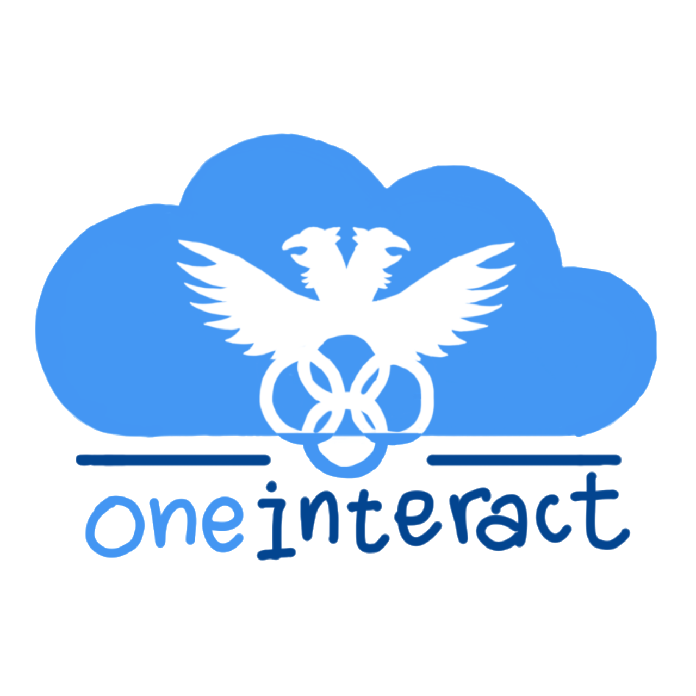

# OneInteract

A monorepo for Raffles Interact's administrative application. 

Built with:

 (+ Minio, TypeOrm, and more...)
## Setting up (development)

### Prerequisites 

Ensure that you have the docker daemon running, along with ``bun``, ``make`` and ``docker`` installed in the CLI. 

Clone with ``git clone https://github.com/raffles-interact/interapp.git``

Obtain both files (containing secret keys and the like) ``interapp-backend/.env.local`` and ``interapp-frontend/.env.local`` from the current set of maintainers.

### First time setup

1. Put in both secret files ``.env.local`` in both the ``interapp-backend`` and ``interapp-frontend`` directories. Note that they are different files.

2. Install packages in both the ``interapp-backend`` and ``interapp-frontend`` directories (do not install in the root directory). Note that these 2 directories act as different project folders and are only unified during the build process with docker.

3. Set up the dev server with ``make build && make run``. Go onto the website and create an account with any username and id you want. Note down this username.
4. Run ``docker exec -it interapp-postgres sh`` (you should see ‘/ #’ pop up) to enter into a interactive shell after the containers are up. Run 
``username=your_username_that_you_signed_up_with PGPASSWORD=postgres psql -U postgres -d interapp -c "INSERT INTO \"user_permission\" (\'username\', \'permission_id\', \'userUsername\') VALUES (\'$username\', 6, \'$username\')"``  to give yourself admin permissions. Exit the interactive shell.

### Running

Run ``make build`` and ``make run`` for the development server. 

If you'd like HMR on the backend/scheduler, use ``make watch`` instead of ``make run`` to use docker compose watch functionality, but this may take additional resources. If you are working on the frontend, ``make run`` is just fine. 

If needed, add ``version=(test|prod)`` for test and production servers respectively, eg. ``make build version=test``

Go to ``localhost:3000`` for frontend and ``localhost:3000/api`` for api routes

## Setting up (testing/non-technical)

Put in both secret files ``.env.local`` in both the ``interapp-backend`` and ``interapp-frontend`` directories. Note that they are different files, which contain sensitive information that should not be shared. Ask the maintainers how to do this if unsure.

1. If you're just testing the UI/frontend, just have ``docker`` installed in your terminal and have Docker desktop running. You can install docker [here](https://docs.docker.com/engine/install/).

2. Download the ZIP file (Scroll to the green button 'Code' > 'Local' tab > Download ZIP) and unzip it in your directory of choice.

3. Right click the folder which you unzipped and copy its path (the location where the folder is stored at). Open a new terminal (command prompt on windows/terminal on Mac), and type ``cd <path-to-the-directory-which-you-copied>``.

4. Verify docker is installed with ``docker -v`` (If the terminal says ``docker`` is not recognised, try reopening another terminal, failing which, restart your computer) and ensure that you have docker desktop open (important!).

5. Run ``docker compose -f docker-compose.prod.yml up --build -d``.

6. Verify the containers are running by going to docker desktop and ensuring all container icons are **green**.

7. Go to ``localhost:3000`` on your browser, and verify that you can see the site.

8. For contributing, see [CONTRIBUTING.md](CONTRIBUTING.md)

## thanks
thank you for coming here :kekw:
